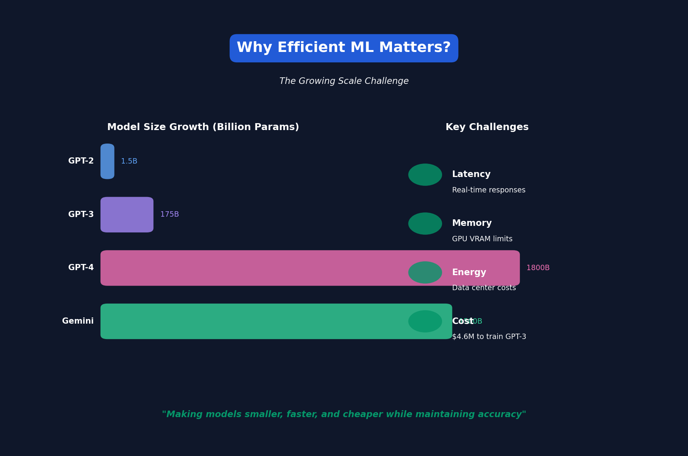

# Lecture 1: Introduction to Efficient ML

[← Back to Course](../README.md) | [Next: Basics →](../02_basics/README.md)

📺 [Watch Lecture 1 on YouTube](https://www.youtube.com/watch?v=RgUl6BlyaF4&list=PL80kAHvQbh-pT4lCkDT53zT8DKmhE0idB&index=1)

 ← **Try the code!**

---

## Why Efficient ML Matters

Machine learning models are getting bigger every year:
- GPT-2 (2019): 1.5B parameters
- GPT-3 (2020): 175B parameters
- GPT-4 (2023): ~1.8T parameters (estimated)

**The Problem:** Bigger models = more compute, more memory, more energy, more cost.

---

## The Efficiency Challenge

| Metric | Challenge |
|--------|-----------|
| **Latency** | Users expect real-time responses |
| **Throughput** | Serving millions of requests |
| **Energy** | Data centers consume massive power |
| **Memory** | GPUs have limited VRAM |
| **Cost** | Training GPT-3 cost ~$4.6M |

---

## Course Topics Overview

1. **Model Compression**
   - Pruning (remove weights)
   - Quantization (use fewer bits)
   - Knowledge Distillation (train smaller models)

2. **Efficient Architectures**
   - Neural Architecture Search
   - Hardware-aware design

3. **Efficient Training**
   - Mixed precision
   - Gradient checkpointing
   - Distributed training

4. **Efficient Inference**
   - KV cache optimization
   - Speculative decoding
   - Batching strategies

---

## Key Insight

> "The goal is not just to make models smaller, but to make them faster and cheaper while maintaining accuracy."

---

## Real-World Impact

| Application | Why Efficiency Matters |
|------------|----------------------|
| Mobile apps | Limited battery and compute |
| Self-driving cars | Real-time decisions needed |
| Voice assistants | Low-latency responses |
| Edge IoT | Microcontrollers have KB of memory |

---

## Resources

- [Course Website](https://efficientml.ai/)
- [Song Han's Lab](https://songhan.mit.edu/)

