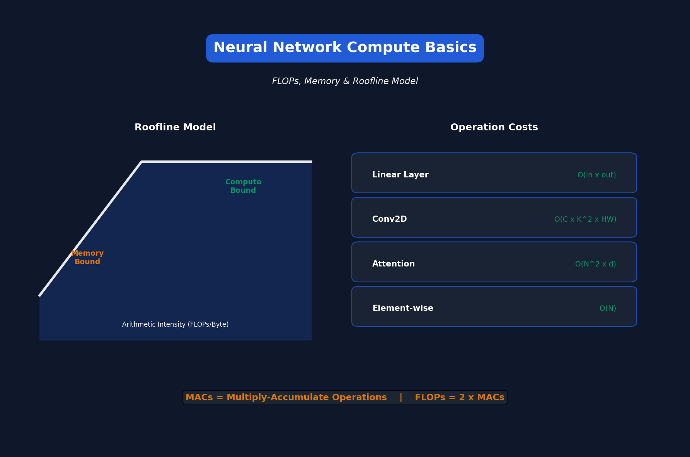

# Lecture 2: Neural Network Basics

[← Back to Course](../README.md) | [← Previous](../01_introduction/README.md) | [Next: Pruning I →](../03_pruning_sparsity_1/README.md)

📺 [Watch Lecture 2 on YouTube](https://www.youtube.com/watch?v=rCFvPEQTxKI&list=PL80kAHvQbh-pT4lCkDT53zT8DKmhE0idB&index=2)

[](https://colab.research.google.com/github/gaurav-redhat/efficientml_course/blob/main/02_basics/demo.ipynb) ← **Try the code!**

---




## Compute Primitives

### FLOPS vs Memory

Understanding efficiency requires knowing what's expensive:

| Operation | Compute | Memory |
|-----------|---------|--------|
| Matrix multiply | High | Low |
| Attention | O(N²) | O(N²) |
| Element-wise | Low | High (bandwidth limited) |

---


## Roofline Model

The **roofline model** helps understand whether your code is:
- **Compute-bound**: Limited by FLOPS (matrix ops)
- **Memory-bound**: Limited by memory bandwidth (element-wise ops)

```
         /----------------- Compute ceiling
        /
       /
      /
-----/  <-- Memory bandwidth ceiling
    |
Arithmetic Intensity (FLOPS/Byte)
```

---


## Key Neural Network Layers

### 1. Convolution
```python
# Memory: O(C_in × C_out × K × K)
# Compute: O(C_in × C_out × K² × H × W)
```

### 2. Linear (Dense)
```python
# Memory: O(in_features × out_features)
# Compute: O(batch × in_features × out_features)
```

### 3. Attention
```python
# Memory: O(N²) for attention matrix
# Compute: O(N² × d) for QK^T and attention × V
```

---


## Hardware Considerations

| Hardware | Good At | Limited By |
|----------|---------|------------|
| CPU | Flexibility | Parallelism |
| GPU | Massive parallelism | Memory bandwidth |
| TPU | Matrix ops | Flexibility |
| MCU | Energy efficiency | Everything |

---


## Efficiency Metrics

1. **Latency** - Time for single inference
2. **Throughput** - Inferences per second
3. **Energy** - Joules per inference
4. **Model size** - Parameters × bytes per param
5. **Peak memory** - Max RAM during inference

---


## Important Equations

**MAC (Multiply-Accumulate):**
```
MACs = number of multiply-add operations
FLOPs ≈ 2 × MACs (multiply + add)
```

**Memory Bandwidth:**
```
Time = Data Size / Bandwidth
```

---


## Resources

- [Roofline Model Paper](https://people.eecs.berkeley.edu/~kubitron/cs252/handouts/papers/RooflineVyNoYellow.pdf)
- [PyTorch Profiler](https://pytorch.org/tutorials/recipes/recipes/profiler_recipe.html)

