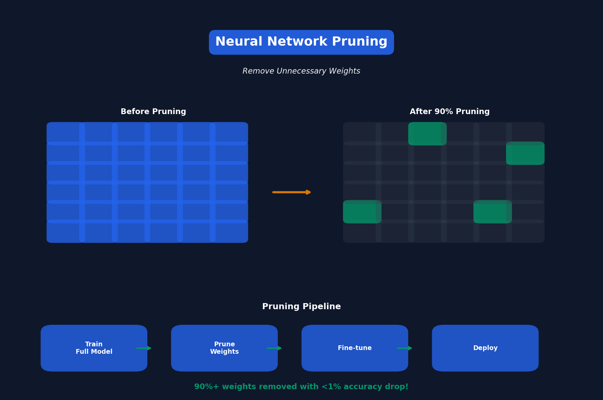

# Lecture 3: Pruning & Sparsity (Part I)

[← Back to Course](../README.md) | [← Previous](../02_basics/README.md) | [Next: Pruning II →](../04_pruning_sparsity_2/README.md)

📺 [Watch Lecture 3 on YouTube](https://www.youtube.com/playlist?list=PL80kAHvQbh-pT4lCkDT53zT8DKmhE0idB&index=3)

[](https://colab.research.google.com/github/gaurav-redhat/efficientml_course/blob/main/03_pruning_sparsity_1/demo.ipynb) ← **Try the code!**

---




## What is Pruning?

**Pruning** removes unnecessary weights from a neural network to make it smaller and faster.

> "Not all weights are created equal — many can be removed with minimal impact on accuracy."

---


## The Pruning Pipeline

```
Train Full Model → Prune Weights → Fine-tune → Deploy
     100%              30%           30%        30%
```

---


## Types of Pruning

### 1. Unstructured Pruning
Remove individual weights anywhere in the network.

```python
# Before: Dense weight matrix
W = [[0.1, 0.5, 0.2],
     [0.8, 0.3, 0.1],
     [0.2, 0.9, 0.4]]

# After: Sparse (zeros scattered)
W = [[0.1, 0.0, 0.2],
     [0.8, 0.0, 0.0],
     [0.0, 0.9, 0.4]]
```

**Pros:** High compression ratios
**Cons:** Needs sparse hardware/libraries

### 2. Structured Pruning
Remove entire channels, filters, or attention heads.

```python
# Before: 64 channels
# After: 32 channels (remove entire channels)
```

**Pros:** Works on standard hardware
**Cons:** Lower compression ratios

---


## Pruning Criteria

How do we decide which weights to remove?

| Criterion | Formula | Intuition |
|-----------|---------|-----------|
| **Magnitude** | \|w\| | Small weights matter less |
| **Gradient** | \|∂L/∂w\| | Low gradient = low impact |
| **Taylor** | \|w × ∂L/∂w\| | Combines both |

---


## Magnitude Pruning

The simplest and most common approach:

```python
def magnitude_prune(weights, sparsity=0.9):
    """Remove smallest 90% of weights"""
    threshold = np.percentile(np.abs(weights), sparsity * 100)
    mask = np.abs(weights) > threshold
    return weights * mask
```

---


## Iterative Pruning

Better results come from pruning gradually:

```
Iteration 1: 0% → 50% sparse, fine-tune
Iteration 2: 50% → 75% sparse, fine-tune
Iteration 3: 75% → 90% sparse, fine-tune
```

This works better than pruning 90% all at once!

---


## Results on ImageNet

| Model | Pruning Ratio | Top-1 Accuracy |
|-------|--------------|----------------|
| AlexNet (original) | 0% | 57.2% |
| AlexNet (pruned) | 89% | 57.2% |
| VGG-16 (original) | 0% | 68.5% |
| VGG-16 (pruned) | 92% | 68.3% |

**Key Insight:** Can remove 90%+ weights with <1% accuracy drop!

---


## Key Paper

📄 **[Learning both Weights and Connections for Efficient Neural Networks](https://arxiv.org/abs/1506.02626)** (Han et al., 2015)

This paper introduced the standard pruning pipeline used today.

---


## Resources

- [PyTorch Pruning Tutorial](https://pytorch.org/tutorials/intermediate/pruning_tutorial.html)
- [Neural Network Pruning Survey](https://arxiv.org/abs/2102.00554)

