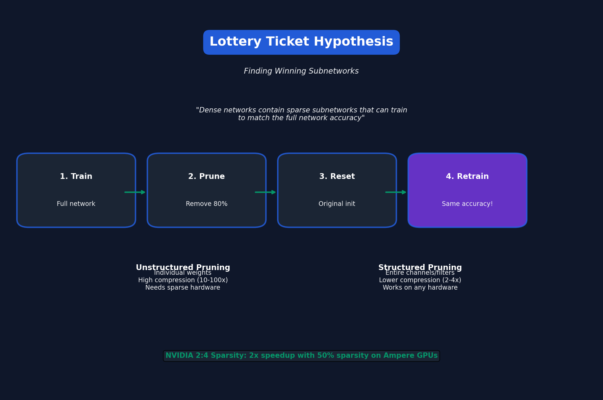

# Lecture 4: Pruning & Sparsity (Part II)

[← Back to Course](../README.md) | [← Previous](../03_pruning_sparsity_1/README.md) | [Next: Quantization I →](../05_quantization_1/README.md)

📺 [Watch Lecture 4 on YouTube](https://www.youtube.com/playlist?list=PL80kAHvQbh-pT4lCkDT53zT8DKmhE0idB&index=4)

[](https://colab.research.google.com/github/gaurav-redhat/efficientml_course/blob/main/04_pruning_sparsity_2/demo.ipynb) ← **Try the code!**

---




## The Lottery Ticket Hypothesis

> "Dense neural networks contain sparse subnetworks (winning tickets) that can train in isolation to match the full network's accuracy."

### Key Findings

1. Random init → Train → Prune → **Reset to original init** → Retrain
2. The "winning ticket" trains just as well as the original!
3. But random reinitialization doesn't work

```
Finding Winning Tickets:
1. Train network to completion
2. Prune smallest weights
3. Reset remaining weights to ORIGINAL initialization
4. Retrain from scratch → Same accuracy!
```

---


## Structured vs Unstructured

| Aspect | Unstructured | Structured |
|--------|-------------|------------|
| Granularity | Individual weights | Channels/filters |
| Compression | Higher (10-100x) | Lower (2-4x) |
| Hardware | Needs sparse support | Any hardware |
| Real speedup | Often none on GPU | Actual speedup |

---


## Sparse Formats

### COO (Coordinate)
Store (row, col, value) for each non-zero:
```python
# Dense: [[1, 0, 2], [0, 0, 3], [4, 0, 0]]
# COO: rows=[0,0,1,2], cols=[0,2,2,0], vals=[1,2,3,4]
```

### CSR (Compressed Sparse Row)
More efficient for row-wise operations:
```python
# vals = [1, 2, 3, 4]
# col_idx = [0, 2, 2, 0]  
# row_ptr = [0, 2, 3, 4]  # Start of each row
```

---


## Hardware Support for Sparsity

| Hardware | Sparse Support |
|----------|---------------|
| NVIDIA Ampere (A100) | 2:4 structured sparsity |
| AMD MI250 | Block sparsity |
| Apple M1/M2 | Limited |
| Intel | Sparse tensor ops |

### NVIDIA 2:4 Sparsity
Every 4 consecutive elements, exactly 2 must be zero:
```
[1.0, 0.0, 0.5, 0.0]  ✓ Valid
[1.0, 0.5, 0.0, 0.0]  ✓ Valid
[1.0, 0.5, 0.3, 0.0]  ✗ Invalid
```
**Result:** 2x speedup with 50% sparsity!

---


## Dynamic Sparsity

Instead of fixed sparsity patterns, let them change during training:

1. **RigL** - Periodic weight regrowth
2. **SET** - Sparse evolutionary training
3. **SNIP** - Prune at initialization

```python
# RigL pseudo-code
for epoch in training:
    if epoch % update_freq == 0:
        # Drop smallest magnitude weights
        drop_mask = magnitude_threshold(weights)
        # Grow new weights based on gradient
        grow_mask = gradient_threshold(gradients)
        update_sparsity_mask(drop_mask, grow_mask)
```

---


## Pruning LLMs

Pruning large language models is different:

| Challenge | Why |
|-----------|-----|
| Emergent abilities | May disappear with pruning |
| Calibration data | Need representative samples |
| Layer sensitivity | Some layers can't be pruned |

### SparseGPT
- Prunes LLMs to 50%+ sparsity
- Uses approximate second-order information
- One-shot (no retraining needed)

---


## Key Papers

- 📄 [Lottery Ticket Hypothesis](https://arxiv.org/abs/1803.03635)
- 📄 [RigL: Dynamic Sparsity](https://arxiv.org/abs/1911.11134)
- 📄 [SparseGPT](https://arxiv.org/abs/2301.00774)

---


## Practical Tips

1. **Start with structured pruning** — works on any hardware
2. **Prune iteratively** — better than one-shot
3. **Fine-tune after pruning** — recovers accuracy
4. **Measure actual speedup** — sparsity ≠ speedup

