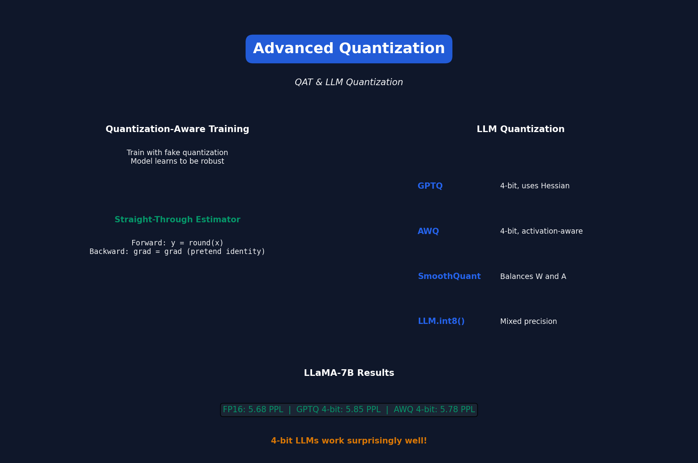

# Lecture 6: Quantization (Part II)

[← Back to Course](../README.md) | [← Previous](../05_quantization_1/README.md) | [Next: NAS I →](../07_neural_architecture_search_1/README.md)

📺 [Watch Lecture 6 on YouTube](https://www.youtube.com/playlist?list=PL80kAHvQbh-pT4lCkDT53zT8DKmhE0idB&index=6)

[](https://colab.research.google.com/github/gaurav-redhat/efficientml_course/blob/main/06_quantization_2/demo.ipynb) ← **Try the code!**

---




## Quantization-Aware Training (QAT)

Train with simulated quantization to improve accuracy:

```python
def fake_quantize(x, scale, zero_point, bits=8):
    """Simulate quantization during training"""
    q_min, q_max = 0, 2**bits - 1
    
    # Forward: quantize
    x_q = torch.clamp(
        torch.round(x / scale + zero_point),
        q_min, q_max
    )
    
    # "Dequantize" back to float for gradient flow
    x_deq = (x_q - zero_point) * scale
    
    return x_deq  # Gradients flow through as if no quantization
```

---


## Straight-Through Estimator (STE)

Rounding is not differentiable. STE approximates gradients:

```
Forward:  y = round(x)
Backward: ∂L/∂x = ∂L/∂y  (pretend round = identity)
```

---


## QAT Pipeline

```
1. Train FP32 model (or start from pretrained)
2. Insert fake quantization nodes
3. Fine-tune with quantization simulation
4. Export to actual INT8 for deployment
```

### Results: QAT vs PTQ

| Model | PTQ INT8 | QAT INT8 | FP32 |
|-------|----------|----------|------|
| MobileNetV2 | 70.8% | 71.7% | 71.9% |
| ResNet-18 | 69.5% | 70.0% | 70.1% |

**QAT recovers most of the accuracy!**

---


## Mixed-Precision Quantization

Not all layers need the same precision:

| Layer Type | Recommended Bits |
|------------|-----------------|
| First conv | 8-bit (sensitive) |
| Last FC | 8-bit (sensitive) |
| Middle layers | 4-bit OK |
| Attention QKV | 8-bit |
| FFN | 4-bit OK |

### Hardware-Aware Mixed Precision

```python
# Automatically find optimal bit-width per layer
sensitivity = measure_layer_sensitivity(model)
bit_allocation = optimize_for_target_size(
    sensitivity, 
    target_bits=4.5  # Average 4.5 bits
)
```

---


## LLM Quantization Challenges

LLMs have **activation outliers** that break standard quantization:

```
Normal activations: [-1, 0.5, 0.8, 1.2, -0.3]
LLM activations:    [-1, 0.5, 50.0, 1.2, -0.3]  # Outlier!
```

### Solutions

1. **LLM.int8()** - Mixed precision for outlier channels
2. **SmoothQuant** - Migrate difficulty from activations to weights
3. **GPTQ** - Second-order weight quantization
4. **AWQ** - Activation-aware weight quantization

---


## SmoothQuant

Key insight: **Weights are easy to quantize, activations are hard.**

Solution: Balance the difficulty:

```python
# Before: hard activations, easy weights
X @ W

# After SmoothQuant: balanced
(X / s) @ (W * s)

# s is chosen to equalize difficulty
s = sqrt(max(|X|) / max(|W|))
```

---


## GPTQ (4-bit LLM Quantization)

Quantize one column at a time, fixing errors in remaining weights:

```
For each column j:
    1. Quantize column j
    2. Compute quantization error
    3. Distribute error to columns j+1, j+2, ... 
       (using Hessian information)
```

**Result:** GPT-3 175B → 4-bit with minimal accuracy loss!

---


## Weight-Only vs Weight+Activation

| Method | Weights | Activations | Use Case |
|--------|---------|-------------|----------|
| Weight-only | INT4 | FP16 | LLM inference |
| W+A | INT8 | INT8 | CNN inference |

**Why weight-only for LLMs?**
- Memory-bound (weights dominate)
- 4-bit weights fit in cache
- FP16 activations preserve accuracy

---


## Practical Results

| Model | Method | Bits | Perplexity |
|-------|--------|------|-----------|
| LLaMA-7B | FP16 | 16 | 5.68 |
| LLaMA-7B | GPTQ | 4 | 5.85 |
| LLaMA-7B | AWQ | 4 | 5.78 |
| LLaMA-65B | GPTQ | 4 | 3.85 |

---


## Key Papers

- 📄 [LLM.int8()](https://arxiv.org/abs/2208.07339)
- 📄 [SmoothQuant](https://arxiv.org/abs/2211.10438)
- 📄 [GPTQ](https://arxiv.org/abs/2210.17323)
- 📄 [AWQ](https://arxiv.org/abs/2306.00978)

---


## Code: 4-bit Quantization with bitsandbytes

```python
from transformers import AutoModelForCausalLM
import torch

# Load model in 4-bit
model = AutoModelForCausalLM.from_pretrained(
    "meta-llama/Llama-2-7b-hf",
    load_in_4bit=True,
    device_map="auto"
)

# Original: 14GB → Quantized: ~4GB
```

---


## Takeaways

1. **QAT > PTQ** for accuracy at low precision
2. **LLMs need special handling** due to outliers
3. **4-bit works surprisingly well** for LLM inference
4. **Weight-only quantization** is standard for LLMs

