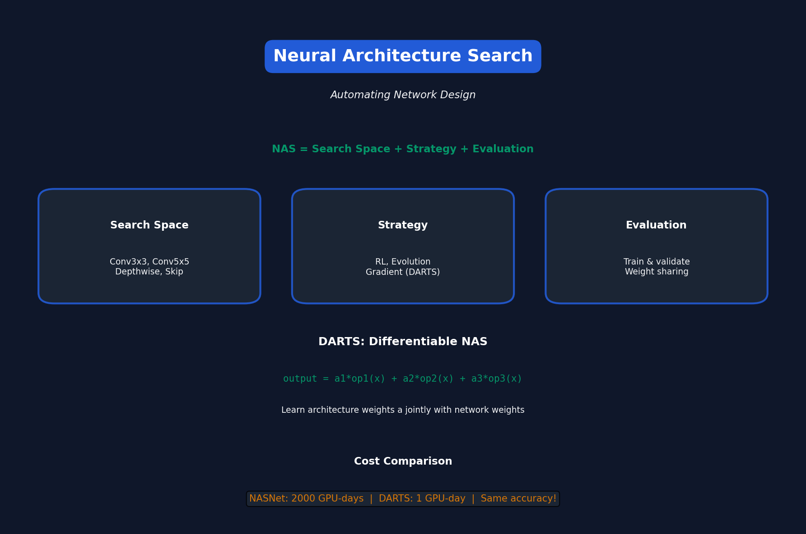

# Lecture 7: Neural Architecture Search (Part I)

[← Back to Course](../README.md) | [← Previous](../06_quantization_2/README.md) | [Next: NAS II →](../08_neural_architecture_search_2/README.md)

📺 [Watch Lecture 7 on YouTube](https://www.youtube.com/playlist?list=PL80kAHvQbh-pT4lCkDT53zT8DKmhE0idB&index=7)

[](https://colab.research.google.com/github/gaurav-redhat/efficientml_course/blob/main/07_neural_architecture_search_1/demo.ipynb) ← **Try the code!**

---



## What is NAS?

**Neural Architecture Search** automates the design of neural networks.

> Instead of humans designing architectures, let algorithms find them!

---

## The NAS Problem

```
Given: Search space, Dataset, Hardware constraints
Find: Architecture that maximizes accuracy 
      while meeting latency/memory targets
```

---

## Components of NAS

### 1. Search Space
What architectures are possible?

| Component | Options |
|-----------|---------|
| Operations | Conv3x3, Conv5x5, MaxPool, Skip |
| Channels | 16, 32, 64, 128 |
| Layers | 10, 20, 50 |
| Connections | Sequential, skip, dense |

### 2. Search Strategy
How do we explore the space?

- Random search
- Reinforcement learning
- Evolutionary algorithms
- Gradient-based (DARTS)

### 3. Performance Estimation
How do we evaluate architectures?

- Train to convergence (slow!)
- Early stopping
- Weight sharing
- Predictor models

---

## Early NAS: RL-based

NASNet (Google, 2017):
```
Controller (RNN) → Sample architecture → Train → Get accuracy → Update controller
```

**Cost:** 500 GPUs × 4 days = 2000 GPU-days 😱

---

## Search Space Design

### Cell-based Search
Don't search entire network, search a repeatable "cell":

```
Network = [Stem] + [Cell × N] + [Head]

Only search for Cell design!
```

### Normal Cell vs Reduction Cell
- **Normal cell:** Same resolution
- **Reduction cell:** Downsample 2x

---

## Key Operations

| Operation | FLOPs | Params |
|-----------|-------|--------|
| Conv 1×1 | Low | Low |
| Conv 3×3 | Medium | Medium |
| Conv 5×5 | High | High |
| Depthwise 3×3 | Very Low | Very Low |
| MaxPool 3×3 | Zero | Zero |
| Skip | Zero | Zero |

---

## MobileNet Search Space

Inspired by MobileNetV2 inverted bottleneck:

```
Input → Conv1x1 (expand) → DepthwiseConv → Conv1x1 (project) → Output

Search over:
- Expansion ratio: {3, 6}
- Kernel size: {3, 5, 7}
- Whether to use skip connection
```

---

## DARTS: Differentiable NAS

Make architecture search differentiable!

```python
# Instead of discrete choice:
output = op_1(x)  # or op_2(x) or op_3(x)

# Use soft weighting:
output = α_1 * op_1(x) + α_2 * op_2(x) + α_3 * op_3(x)

# After training, pick argmax(α)
```

**Cost:** Single GPU, ~1 day

---

## DARTS Algorithm

```
1. Initialize architecture weights α
2. For each epoch:
   a. Update network weights w (gradient descent on train loss)
   b. Update architecture weights α (gradient descent on val loss)
3. Discretize: pick top operations
4. Retrain from scratch
```

---

## Results

| Method | GPU-days | CIFAR-10 Acc |
|--------|----------|--------------|
| Manual (ResNet) | Human | 95.4% |
| NASNet | 2000 | 96.6% |
| DARTS | 1 | 97.0% |
| ProxylessNAS | 8 | 97.9% |

---

## Key Papers

- 📄 [NASNet](https://arxiv.org/abs/1707.07012) - Original RL-based NAS
- 📄 [DARTS](https://arxiv.org/abs/1806.09055) - Differentiable NAS
- 📄 [EfficientNet](https://arxiv.org/abs/1905.11946) - Compound scaling

---

## Next Lecture

Part II covers **Hardware-Aware NAS** and **Once-for-All Networks**.

