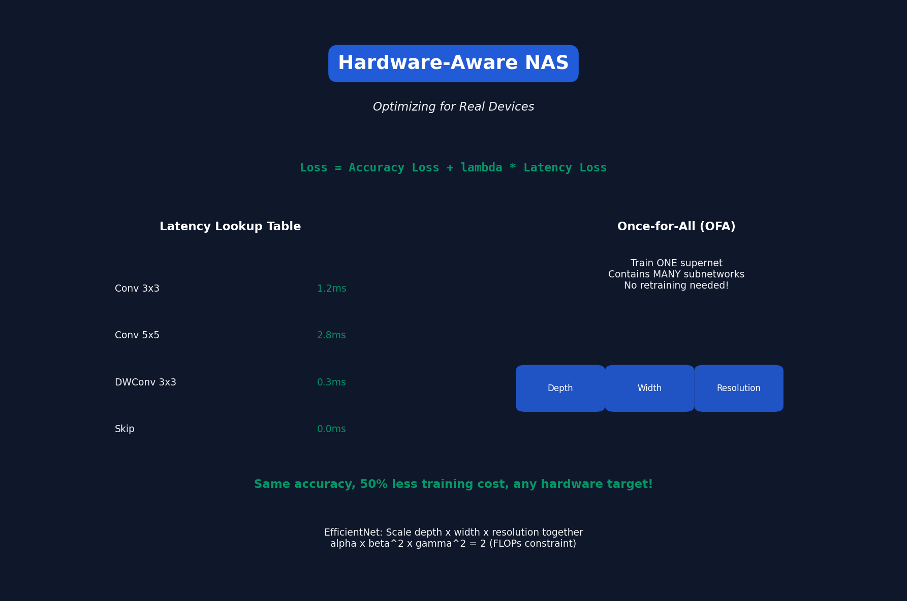

# Lecture 8: Neural Architecture Search (Part II)

[← Back to Course](../README.md) | [← Previous](../07_neural_architecture_search_1/README.md) | [Next: Distillation →](../09_knowledge_distillation/README.md)

📺 [Watch Lecture 8 on YouTube](https://www.youtube.com/playlist?list=PL80kAHvQbh-pT4lCkDT53zT8DKmhE0idB&index=8)

[](https://colab.research.google.com/github/gaurav-redhat/efficientml_course/blob/main/08_neural_architecture_search_2/demo.ipynb) ← **Try the code!**

---



## Hardware-Aware NAS

Standard NAS optimizes accuracy. **Hardware-aware NAS** optimizes for real hardware:

```
Objective: max Accuracy
Subject to: Latency ≤ 20ms on iPhone
            Memory ≤ 500MB
```

---

## ProxylessNAS

Train directly on target hardware metrics:

```python
# Loss function
loss = CE_loss + λ * latency_loss

# Latency is differentiable!
latency = Σ (α_i * latency_i)  # Weighted sum of op latencies
```

---

## Latency Lookup Tables

Pre-measure latency of each operation on target hardware:

| Operation | GPU (ms) | CPU (ms) | Mobile (ms) |
|-----------|----------|----------|-------------|
| Conv 3×3, C=64 | 0.12 | 2.1 | 4.5 |
| Conv 5×5, C=64 | 0.28 | 5.2 | 9.8 |
| DWConv 3×3, C=64 | 0.03 | 0.4 | 0.8 |

**Total latency = sum of per-layer latencies**

---

## Once-for-All (OFA)

Train ONE network that contains MANY sub-networks:

```
Full Network: depth=20, width=1.0, resolution=224

Sub-networks:
- depth=12, width=0.5, resolution=160 (mobile)
- depth=16, width=0.75, resolution=192 (tablet)
- depth=20, width=1.0, resolution=224 (server)
```

---

## OFA Training

Progressive shrinking:

```
Phase 1: Train full network
Phase 2: Support elastic depth (drop layers)
Phase 3: Support elastic width (drop channels)
Phase 4: Support elastic resolution
```

### Knowledge Distillation
Larger sub-networks teach smaller ones:
```python
loss = CE_loss + KD_loss(small_net, large_net)
```

---

## OFA Deployment

```
1. Define hardware constraints
2. Use evolutionary search on OFA network
3. Find best sub-network (no training needed!)
4. Deploy

Search time: ~3 hours on CPU
Training time: 0 (reuse OFA weights)
```

---

## Results: OFA vs Individual Training

| Target | Individual Train | OFA |
|--------|-----------------|-----|
| Mobile (40ms) | 80.0% | 79.8% |
| GPU (5ms) | 80.0% | 80.1% |
| Total GPU-hours | 2400 | 1200 |

**Same accuracy, half the training cost!**

---

## MnasNet: Mobile NAS

Google's mobile-optimized NAS:

```
Reward = Accuracy × (Latency/Target)^w

w = -0.07 if Latency > Target
w = -0.07 if Latency ≤ Target
```

This penalizes missing the latency target.

---

## EfficientNet: Compound Scaling

Instead of NAS, scale depth/width/resolution together:

```
depth = α^φ
width = β^φ  
resolution = γ^φ

α × β² × γ² ≈ 2 (FLOPS constraint)
```

| Model | Resolution | Width | Depth | Params |
|-------|------------|-------|-------|--------|
| B0 | 224 | 1.0 | 1.0 | 5.3M |
| B4 | 380 | 1.4 | 1.8 | 19M |
| B7 | 600 | 2.0 | 3.1 | 66M |

---

## NAS for Transformers

Recent work applies NAS to transformers:

- **AutoFormer** - Search attention heads, MLP ratio
- **ViT-NAS** - Hardware-aware ViT search
- **NAS-BERT** - BERT architecture search

---

## Key Papers

- 📄 [ProxylessNAS](https://arxiv.org/abs/1812.00332)
- 📄 [Once-for-All](https://arxiv.org/abs/1908.09791)
- 📄 [MnasNet](https://arxiv.org/abs/1807.11626)
- 📄 [EfficientNet](https://arxiv.org/abs/1905.11946)

---

## Practical Tips

1. **Start with a good search space** — NAS can't find what's not there
2. **Use weight sharing** — Saves massive compute
3. **Measure real latency** — FLOPs ≠ speed
4. **Consider deployment early** — Different hardware = different optimal architecture

