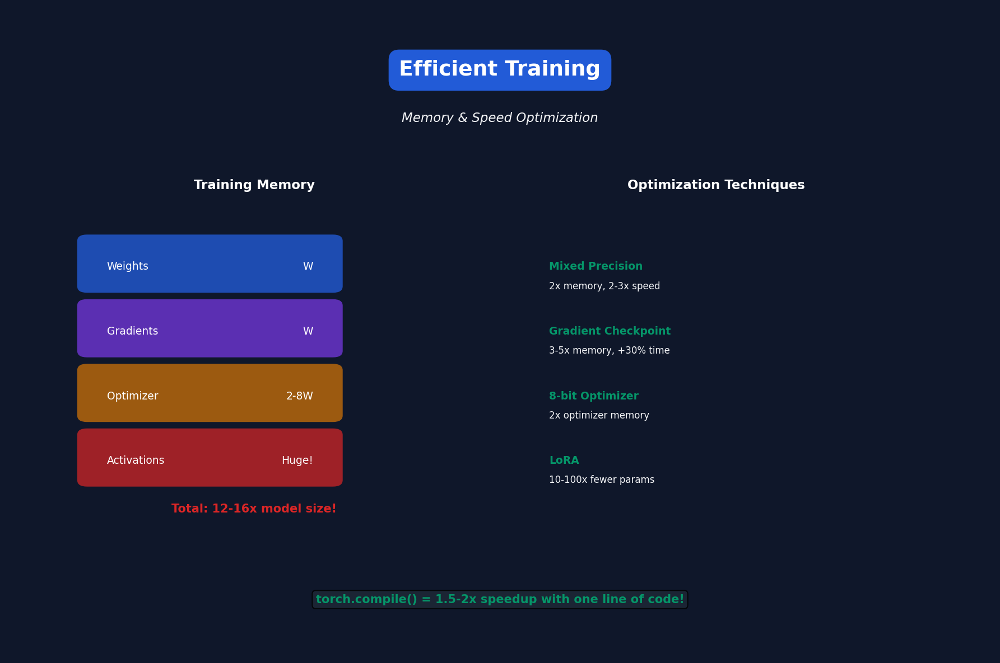

# Lecture 12: Efficient Training

[← Back to Course](../README.md) | [← Previous](../11_efficient_transformers/README.md) | [Next: On-Device Training →](../13_on_device_training/README.md)

📺 [Watch Lecture 12 on YouTube](https://www.youtube.com/playlist?list=PL80kAHvQbh-pT4lCkDT53zT8DKmhE0idB&index=12)

[](https://colab.research.google.com/github/gaurav-redhat/efficientml_course/blob/main/12_efficient_training/demo.ipynb) ← **Try the code!**

---



## Training Memory Breakdown

Where does memory go during training?

| Component | Size | Notes |
|-----------|------|-------|
| Model weights | W | Parameters |
| Gradients | W | Same size as weights |
| Optimizer states | 2W-8W | Adam: momentum + variance |
| Activations | Huge | Grows with batch × seq |

**Total for Adam: ~12-16x model size!**

---

## Mixed Precision Training

Use FP16 for most operations, FP32 for critical ones:

```python
from torch.cuda.amp import autocast, GradScaler

scaler = GradScaler()

for batch in dataloader:
    optimizer.zero_grad()
    
    # Forward in FP16
    with autocast():
        output = model(batch)
        loss = criterion(output)
    
    # Backward with scaling (prevents underflow)
    scaler.scale(loss).backward()
    scaler.step(optimizer)
    scaler.update()
```

**Benefits:** 2x memory reduction, 2-3x speedup

---

## BF16 vs FP16

| Format | Exponent | Mantissa | Range | Precision |
|--------|----------|----------|-------|-----------|
| FP32 | 8 | 23 | ±3.4e38 | High |
| FP16 | 5 | 10 | ±65504 | Low |
| BF16 | 8 | 7 | ±3.4e38 | Lower |

**BF16 is better for training** — same range as FP32, no overflow issues.

---

## Gradient Checkpointing

Trade compute for memory:

```python
# Normal: Store all activations
act1 = layer1(x)      # Store
act2 = layer2(act1)   # Store
act3 = layer3(act2)   # Store
loss.backward()       # Use stored activations

# Checkpointed: Recompute activations
act1 = layer1(x)      # Checkpoint (don't store)
act2 = layer2(act1)   # Checkpoint
act3 = layer3(act2)   # Store
loss.backward()       # Recompute act1, act2 as needed
```

**Memory: O(√N) instead of O(N)**
**Compute: ~30% more**

---

## Gradient Accumulation

Simulate large batch with small GPU:

```python
accumulation_steps = 4
target_batch_size = 32  # Effective batch
micro_batch_size = 8    # Fits in GPU

optimizer.zero_grad()
for i, batch in enumerate(dataloader):
    loss = model(batch) / accumulation_steps
    loss.backward()
    
    if (i + 1) % accumulation_steps == 0:
        optimizer.step()
        optimizer.zero_grad()
```

---

## Memory-Efficient Optimizers

### 8-bit Adam
Quantize optimizer states:

```python
import bitsandbytes as bnb

optimizer = bnb.optim.Adam8bit(
    model.parameters(),
    lr=1e-4
)
```

Memory: 2 bytes/param instead of 8 bytes/param

### Adafactor
No momentum storage:

```
Memory: O(n + m) instead of O(n × m) for weight matrix
```

---

## LoRA for Training

Only train low-rank adapters:

```python
# Instead of training all weights
W_new = W + ΔW  # ΔW is full rank (expensive)

# LoRA: low-rank decomposition
W_new = W + BA  # B: d×r, A: r×d (r << d)
```

Training parameters: 0.1-1% of original

---

## Training Speed Optimizations

| Technique | Speedup | Notes |
|-----------|---------|-------|
| Mixed precision | 2-3x | Use BF16/FP16 |
| Compiled model | 1.5-2x | `torch.compile()` |
| FlashAttention | 2-4x | Memory access |
| Fused optimizers | 1.2x | Fewer kernel launches |

---

## torch.compile()

JIT compile your model for faster execution:

```python
model = MyModel()
model = torch.compile(model)  # That's it!

# First batch is slow (compilation)
# Subsequent batches are faster
```

What it does:
- Fuses operations
- Optimizes memory access
- Generates optimized CUDA code

---

## Progressive Training

Start small, scale up:

```
Stage 1: batch=512, seq_len=512, lr=1e-3
Stage 2: batch=256, seq_len=1024, lr=5e-4
Stage 3: batch=128, seq_len=2048, lr=1e-4
```

Benefits:
- Faster convergence
- See more tokens early
- Gradual increase in difficulty

---

## Learning Rate Schedule

### Warmup + Cosine Decay
```python
def lr_schedule(step, warmup_steps, total_steps, max_lr):
    if step < warmup_steps:
        return max_lr * step / warmup_steps
    else:
        progress = (step - warmup_steps) / (total_steps - warmup_steps)
        return max_lr * 0.5 * (1 + cos(pi * progress))
```

---

## Memory Summary

| Technique | Memory Saved | Trade-off |
|-----------|--------------|-----------|
| Mixed precision | 2x | Minor precision |
| Gradient checkpoint | 3-5x | 30% slower |
| 8-bit optimizer | 2x | Minor precision |
| LoRA | 10-100x | Only train adapter |

---

## Key Papers

- 📄 [Mixed Precision Training](https://arxiv.org/abs/1710.03740)
- 📄 [Gradient Checkpointing](https://arxiv.org/abs/1604.06174)
- 📄 [8-bit Adam](https://arxiv.org/abs/2110.02861)
- 📄 [LoRA](https://arxiv.org/abs/2106.09685)

