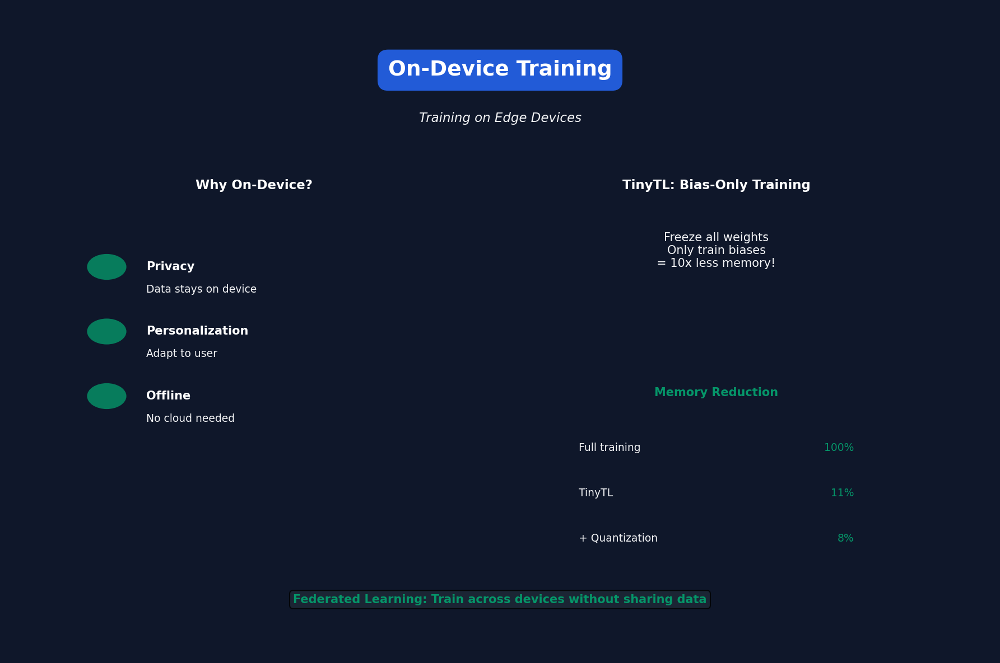

# Lecture 13: On-Device Training

[← Back to Course](../README.md) | [← Previous](../12_efficient_training/README.md) | [Next: Distributed Training →](../14_distributed_training/README.md)

📺 [Watch Lecture 13 on YouTube](https://www.youtube.com/playlist?list=PL80kAHvQbh-pT4lCkDT53zT8DKmhE0idB&index=13)

[](https://colab.research.google.com/github/gaurav-redhat/efficientml_course/blob/main/13_on_device_training/demo.ipynb) ← **Try the code!**

---




## Why On-Device Training?

Training directly on edge devices enables:

| Benefit | Example |
|---------|---------|
| **Privacy** | Personal photos never leave phone |
| **Personalization** | Adapt to user's voice |
| **Continuous learning** | Improve from new data |
| **Offline** | No cloud connection needed |

---


## The Challenge

Training needs MORE memory than inference:

| Component | Inference | Training |
|-----------|-----------|----------|
| Weights | ✓ | ✓ |
| Activations | ✓ (partial) | ✓ (all) |
| Gradients | ✗ | ✓ |
| Optimizer | ✗ | ✓ |

**Training memory ≈ 10-20x inference memory**

---


## Memory Breakdown for Training

```
Model: 1M params (4MB in FP32)

Inference: 4MB weights + ~2MB activations = ~6MB

Training:  4MB weights
         + 4MB gradients
         + 8MB optimizer (Adam)
         + 10MB activations (all layers)
         = 26MB minimum!
```

---


## Reducing Activation Memory

### 1. Gradient Checkpointing
Don't store all activations, recompute:

```
Forward: Store only checkpoints
Backward: Recompute activations from checkpoints
```

### 2. Micro-batch Training
Very small batch size (1-4):

```python
# Instead of batch=32
# Use batch=2 with gradient accumulation
```

### 3. Sparse Update
Only compute gradients for subset of layers:

```python
# Freeze most layers
for param in model.backbone.parameters():
    param.requires_grad = False

# Train only last few layers
for param in model.head.parameters():
    param.requires_grad = True
```

---


## TinyTL: Tiny Transfer Learning

Key insight: **Bias gradients are cheap!**

```python
# Standard fine-tuning
W_new = W - lr * ∂L/∂W  # Need full activation for ∂L/∂W

# Bias-only fine-tuning
b_new = b - lr * ∂L/∂b  # Only need output activation!
```

Memory: Reduce activation storage by ~10x

---


## Activation-Efficient Training

### Forward: Memory-light operations
```python
# Normal Conv2D: Stores input for backward
# Memory-efficient: Reconstruct input from output (invertible)
```

### Backward: In-place operations
```python
# Instead of storing gradients separately
# Accumulate gradients in-place
```

---


## Quantized Training

Train with low-precision:

```python
# Forward: INT8 ops
output = int8_matmul(input_int8, weight_int8)

# Backward: FP16 gradients (for precision)
grad = compute_gradient_fp16(output, target)

# Update: Convert and apply
weight_fp32 += lr * grad
```

---


## Results: Training on Mobile

| Method | Memory | Accuracy Drop |
|--------|--------|---------------|
| Full training | 100% | 0% |
| TinyTL (bias-only) | 11% | -0.5% |
| + Lite residual | 15% | -0.2% |
| + Quantization | 8% | -0.3% |

---


## Federated Learning

Train across many devices without sharing data:

```
Round:
1. Server sends model to devices
2. Each device trains on local data
3. Devices send gradients/updates to server
4. Server aggregates updates
5. Repeat
```

### FedAvg Algorithm
```python
# Server
global_model = initialize_model()

for round in range(num_rounds):
    # Select subset of devices
    devices = sample_devices(fraction=0.1)
    
    # Each device trains locally
    updates = []
    for device in devices:
        local_update = device.train(global_model, epochs=5)
        updates.append(local_update)
    
    # Aggregate
    global_model = average(updates)
```

---


## On-Device Training Frameworks

| Framework | Platform | Features |
|-----------|----------|----------|
| TensorFlow Lite | Mobile | Basic training |
| Core ML | iOS | On-device training |
| ONNX Runtime | Cross-platform | Training mode |
| TinyEngine | MCU | Memory-optimized |

---


## Practical Considerations

### Battery
- Training is ~10x more power than inference
- Schedule training during charging

### Thermal
- Sustained training causes overheating
- Implement thermal throttling

### Data
- Labeling on-device is hard
- Use self-supervised or semi-supervised methods

---


## Key Papers

- 📄 [TinyTL](https://arxiv.org/abs/2007.11622)
- 📄 [On-Device Training Under 256KB Memory](https://arxiv.org/abs/2206.15472)
- 📄 [Federated Learning](https://arxiv.org/abs/1602.05629)

---


## Summary

| Technique | Memory Reduction | Use Case |
|-----------|------------------|----------|
| Sparse update | 5-10x | Fine-tuning |
| Bias-only | 10x | Adaptation |
| Gradient checkpoint | 3-5x | General |
| Quantized training | 2-4x | When precision OK |

