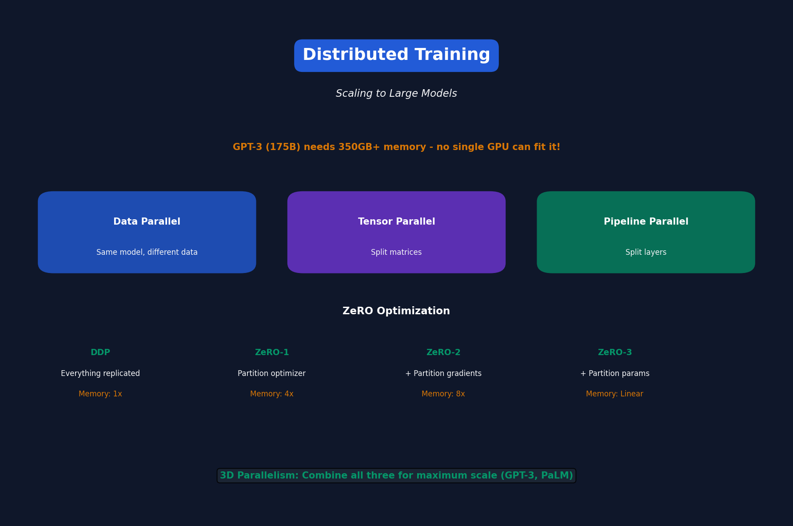

# Lecture 14: Distributed Training

[← Back to Course](../README.md) | [← Previous](../13_on_device_training/README.md) | [Next: Efficient Vision →](../15_efficient_vision_models/README.md)

📺 [Watch Lecture 14 on YouTube](https://www.youtube.com/playlist?list=PL80kAHvQbh-pT4lCkDT53zT8DKmhE0idB&index=14)

[](https://colab.research.google.com/github/gaurav-redhat/efficientml_course/blob/main/14_distributed_training/demo.ipynb) ← **Try the code!**

---



## Why Distributed Training?

Large models don't fit on one GPU:

| Model | Parameters | Memory (FP16) | GPUs Needed |
|-------|------------|---------------|-------------|
| GPT-2 | 1.5B | 3GB | 1 |
| GPT-3 | 175B | 350GB | 44+ |
| PaLM | 540B | 1TB | 135+ |

---

## Parallelism Strategies

### 1. Data Parallelism
Same model on multiple GPUs, different data:

```
GPU 0: Model copy, Batch 0 → Gradient 0
GPU 1: Model copy, Batch 1 → Gradient 1
GPU 2: Model copy, Batch 2 → Gradient 2

Sync: Average(Gradient 0, 1, 2) → Update all copies
```

### 2. Model/Tensor Parallelism
Split model across GPUs:

```
GPU 0: Layers 0-10
GPU 1: Layers 11-20
GPU 2: Layers 21-30
```

### 3. Pipeline Parallelism
Split by layers, pipeline batches:

```
GPU 0: Layer 0-10   [B1][B2][B3]...
GPU 1: Layer 11-20      [B1][B2][B3]...
GPU 2: Layer 21-30          [B1][B2]...
```

---

## Data Parallel (DDP)

```python
import torch.distributed as dist
from torch.nn.parallel import DistributedDataParallel as DDP

# Initialize process group
dist.init_process_group("nccl")
local_rank = int(os.environ["LOCAL_RANK"])

# Wrap model
model = model.to(local_rank)
model = DDP(model, device_ids=[local_rank])

# Training is the same!
for batch in dataloader:
    loss = model(batch)
    loss.backward()  # Gradients synced automatically
    optimizer.step()
```

---

## ZeRO (Zero Redundancy Optimizer)

Standard DDP: Every GPU has full model + optimizer + gradients

**ZeRO: Partition optimizer states across GPUs**

| Stage | Partitioned | Memory per GPU |
|-------|-------------|----------------|
| ZeRO-1 | Optimizer states | 4x reduction |
| ZeRO-2 | + Gradients | 8x reduction |
| ZeRO-3 | + Parameters | Linear scaling |

---

## DeepSpeed

Microsoft's library for efficient distributed training:

```python
import deepspeed

model, optimizer, _, _ = deepspeed.initialize(
    model=model,
    config={
        "train_batch_size": 256,
        "fp16": {"enabled": True},
        "zero_optimization": {
            "stage": 2,  # ZeRO-2
        }
    }
)

for batch in dataloader:
    loss = model(batch)
    model.backward(loss)
    model.step()
```

---

## FSDP (Fully Sharded Data Parallel)

PyTorch native ZeRO-3:

```python
from torch.distributed.fsdp import FullyShardedDataParallel as FSDP

model = FSDP(
    model,
    sharding_strategy=ShardingStrategy.FULL_SHARD,  # ZeRO-3
    mixed_precision=MixedPrecision(
        param_dtype=torch.bfloat16,
        reduce_dtype=torch.bfloat16,
    )
)
```

---

## Tensor Parallelism

Split matrices across GPUs:

```
Weight matrix W (4096 × 4096)
Split into: W0 (4096 × 2048) on GPU 0
            W1 (4096 × 2048) on GPU 1

Forward: 
  Y0 = X × W0 on GPU 0
  Y1 = X × W1 on GPU 1
  Y = concat(Y0, Y1)
```

### Megatron-LM Style
```
Column parallel: Split weight columns
Row parallel: Split weight rows
Combine for MLP: Column → Row (no sync between)
```

---

## Pipeline Parallelism

Split layers across GPUs, overlap compute:

```
Time →
GPU 0: [F1][F2][F3][F4]            [B4][B3][B2][B1]
GPU 1:    [F1][F2][F3][F4]     [B4][B3][B2][B1]
GPU 2:       [F1][F2][F3][F4][B4][B3][B2][B1]

F = Forward, B = Backward
```

**Problem:** "Bubble" time when GPUs are idle.

### GPipe
Micro-batching reduces bubble time.

---

## 3D Parallelism

Combine all three for maximum scale:

```
Data Parallel: Across nodes
Tensor Parallel: Within node (fast NVLink)
Pipeline Parallel: Across nodes
```

Example: Training GPT-3
- 8-way tensor parallel per node
- 64-way pipeline parallel
- Data parallel for larger batches

---

## Communication Primitives

| Operation | Description | Use Case |
|-----------|-------------|----------|
| AllReduce | Sum across all GPUs | Gradient sync |
| AllGather | Collect from all GPUs | ZeRO-3 forward |
| ReduceScatter | Reduce + scatter | ZeRO-3 backward |
| Broadcast | Send to all GPUs | Initialize |

---

## Communication Optimization

### Gradient Compression
Send fewer bits:

```python
# Instead of FP32 gradients
# Send top-k gradients + INT8 for rest
```

### Overlap Communication
```python
# Compute layer i+1 while communicating layer i gradients
```

---

## Scaling Laws

How do we scale efficiently?

| Tokens | Model Size | Compute (FLOPs) |
|--------|------------|-----------------|
| 1T | 70B | 2e23 |
| 10T | 280B | 2e24 |

**Chinchilla optimal:** Tokens ≈ 20 × Parameters

---

## Key Libraries

| Library | Strengths |
|---------|-----------|
| DeepSpeed | ZeRO, easy to use |
| Megatron-LM | Tensor parallelism |
| FSDP | PyTorch native |
| Colossal-AI | Chinese models |
| Fairscale | Meta's library |

---

## Key Papers

- 📄 [ZeRO](https://arxiv.org/abs/1910.02054)
- 📄 [Megatron-LM](https://arxiv.org/abs/1909.08053)
- 📄 [GPipe](https://arxiv.org/abs/1811.06965)
- 📄 [Chinchilla](https://arxiv.org/abs/2203.15556)

---

## Practical Tips

1. **Start with DDP** — Simple and effective
2. **Use ZeRO-2 first** — Best memory/speed trade-off
3. **Tensor parallel within node** — NVLink is fast
4. **Pipeline parallel across nodes** — Hides network latency

