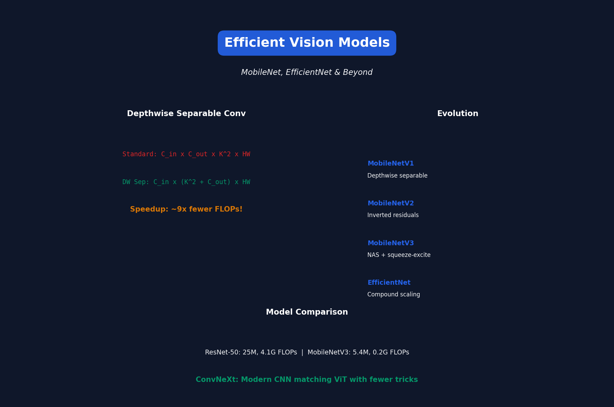

# Lecture 15: Efficient Vision Models

[← Back to Course](../README.md) | [← Previous](../14_distributed_training/README.md) | [Next: Efficient LLMs →](../16_efficient_llms/README.md)

📺 [Watch Lecture 15 on YouTube](https://www.youtube.com/playlist?list=PL80kAHvQbh-pT4lCkDT53zT8DKmhE0idB&index=15)

[](https://colab.research.google.com/github/gaurav-redhat/efficientml_course/blob/main/15_efficient_vision_models/demo.ipynb) ← **Try the code!**

---




## Evolution of Efficient CNNs

```
LeNet (1998) → AlexNet (2012) → VGG (2014) → ResNet (2015)
     ↓
MobileNet (2017) → EfficientNet (2019) → ConvNeXt (2022)
```

---


## Depthwise Separable Convolution

The key to efficient CNNs:

**Standard Conv:**
```
Input: C_in × H × W
Kernel: C_out × C_in × K × K
FLOPs: C_in × C_out × K² × H × W
```

**Depthwise Separable:**
```
Depthwise: C_in × 1 × K × K  (spatial only)
Pointwise: C_out × C_in × 1 × 1  (channel mixing)
FLOPs: C_in × (K² + C_out) × H × W
```

**Speedup: ~K² / 2 = 4-9x fewer FLOPs!**

---


## MobileNet Family

### MobileNetV1
- Depthwise separable convolutions
- Width multiplier α for scaling

### MobileNetV2
- Inverted residuals
- Linear bottlenecks

```
Input → Expand (1×1) → Depthwise (3×3) → Project (1×1) → Output
  \____________________________________________/
               Skip connection
```

### MobileNetV3
- NAS-optimized architecture
- Hard-swish activation
- Squeeze-and-excite

---


## ShuffleNet

Reduce pointwise conv cost with channel shuffle:

```
Group Conv: Split channels into groups
Channel Shuffle: Mix channels between groups
Result: Group conv + shuffle ≈ full conv quality
```

---


## EfficientNet

Compound scaling: Scale depth, width, resolution together:

```
d = α^φ  (depth)
w = β^φ  (width)
r = γ^φ  (resolution)

α × β² × γ² ≈ 2 (constant FLOPs)
```

| Model | Input | Params | Top-1 |
|-------|-------|--------|-------|
| B0 | 224 | 5.3M | 77.1% |
| B3 | 300 | 12M | 81.6% |
| B7 | 600 | 66M | 84.3% |

---


## Vision Transformers (ViT)

Apply transformer to images:

```
Image 224×224 → Split into 16×16 patches → 196 tokens
196 tokens × 768 dim → Transformer → Classification
```

### Problem: ViTs are inefficient
- Fixed patch size (no multi-scale)
- Quadratic attention (long for large images)
- Need lots of data

---


## Efficient ViT Techniques

### 1. Hierarchical ViTs (Swin)
```
Stage 1: 56×56 patches, 96 dim
Stage 2: 28×28 patches, 192 dim
Stage 3: 14×14 patches, 384 dim
Stage 4: 7×7 patches, 768 dim
```

### 2. Window Attention
Only attend within local windows:
```
Complexity: O(N²) → O(N × W²)
W = window size (e.g., 7×7)
```

### 3. Mobile ViT
Combine convolution + transformer:
```
Conv → Transformer → Conv
```

---


## ConvNeXt: Modernized CNN

CNNs can match ViT with modern training:

| Improvement | Description |
|-------------|-------------|
| Patchify stem | 4×4 conv, stride 4 |
| Fewer activations | Only after depthwise |
| Inverted bottleneck | Like MobileNetV2 |
| Larger kernel | 7×7 depthwise |
| Layer norm | Instead of batch norm |
| GELU | Instead of ReLU |

---


## Efficiency Comparison

| Model | Params | FLOPs | ImageNet Top-1 |
|-------|--------|-------|----------------|
| ResNet-50 | 25M | 4.1G | 76.1% |
| EfficientNet-B0 | 5.3M | 0.4G | 77.1% |
| MobileNetV3-L | 5.4M | 0.2G | 75.2% |
| Swin-T | 28M | 4.5G | 81.3% |
| ConvNeXt-T | 28M | 4.5G | 82.1% |

---


## Efficient Detection

### YOLO Evolution
```
YOLOv1 (2016) → YOLOv5 (2020) → YOLOv8 (2023)
     63 FPS      140 FPS         200+ FPS
```

### Key Techniques
- Feature Pyramid Networks (FPN)
- CSP (Cross Stage Partial)
- Anchor-free detection

---


## Mobile Deployment Tips

| Technique | Benefit |
|-----------|---------|
| INT8 quantization | 2-4x speedup |
| CoreML / TFLite | Hardware acceleration |
| Batch size 1 | Lower latency |
| Input resolution | Biggest impact on speed |

---


## Neural Architecture Search for Vision

| Model | Search Space | Target |
|-------|-------------|--------|
| MnasNet | MobileNetV2 | Mobile latency |
| EfficientNet | MobileNetV2 | FLOPs |
| RegNet | Simple primitives | GPU throughput |
| TinyNet | MCUNet | MCU memory |

---


## Key Papers

- 📄 [MobileNetV1](https://arxiv.org/abs/1704.04861)
- 📄 [MobileNetV2](https://arxiv.org/abs/1801.04381)
- 📄 [EfficientNet](https://arxiv.org/abs/1905.11946)
- 📄 [Swin Transformer](https://arxiv.org/abs/2103.14030)
- 📄 [ConvNeXt](https://arxiv.org/abs/2201.03545)

---


## Practical Recommendations

| Use Case | Recommended Model |
|----------|-------------------|
| Mobile (CPU) | MobileNetV3 |
| Mobile (NPU) | EfficientNet-Lite |
| Server (throughput) | RegNet/ConvNeXt |
| Accuracy-first | Swin/ConvNeXt-L |
| MCU | MCUNet |

