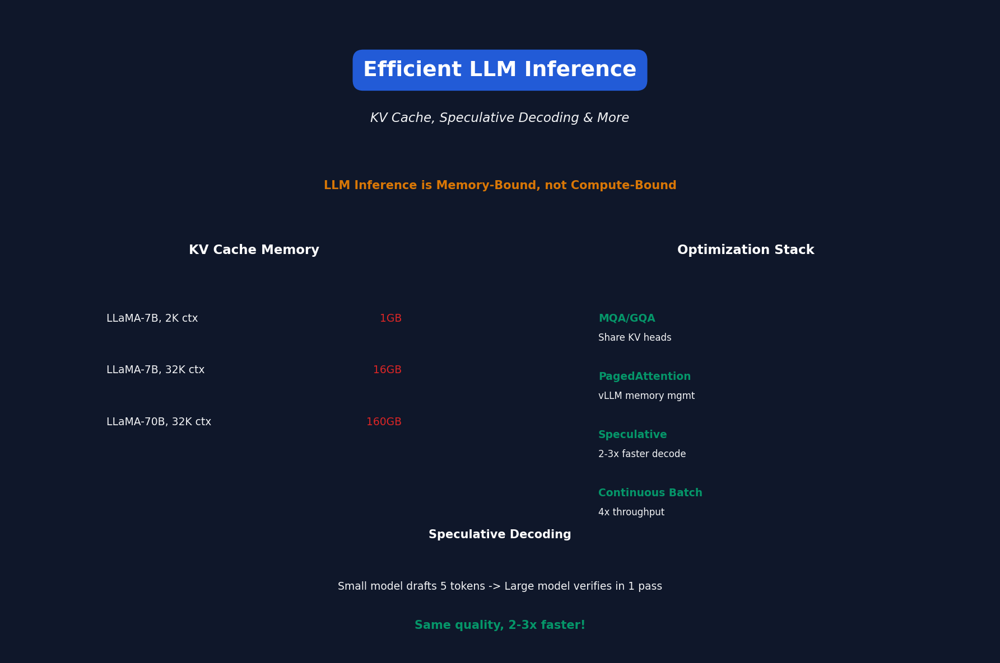

# Lecture 16: Efficient Large Language Models

[← Back to Course](../README.md) | [← Previous](../15_efficient_vision_models/README.md) | [Next: Efficient Diffusion →](../17_efficient_diffusion_models/README.md)

📺 [Watch Lecture 16 on YouTube](https://www.youtube.com/playlist?list=PL80kAHvQbh-pT4lCkDT53zT8DKmhE0idB&index=16)

[](https://colab.research.google.com/github/gaurav-redhat/efficientml_course/blob/main/16_efficient_llms/demo.ipynb) ← **Try the code!**

---



## LLM Inference Characteristics

LLM inference is **memory-bound**, not compute-bound:

```
Batch size 1, seq_len 2048:
- Compute: Matrix ops (fast)
- Memory: Load 7B weights from HBM (slow!)

Arithmetic Intensity = FLOPs / Bytes loaded < 1
```

---

## KV Cache Deep Dive

During autoregressive generation:

```python
# Without KV cache (wasteful)
for each new token:
    K = compute_key(all_previous_tokens)  # Recompute!
    V = compute_value(all_previous_tokens)

# With KV cache (efficient)
kv_cache = {}
for each new token:
    k_new = compute_key(new_token_only)
    v_new = compute_value(new_token_only)
    kv_cache.append(k_new, v_new)
    # Use cached K, V for attention
```

### KV Cache Memory

```
Memory = 2 × layers × seq_len × d_model × dtype_size

For LLaMA-7B, 2K context, FP16:
= 2 × 32 × 2048 × 4096 × 2 bytes = 1GB per request!
```

---

## Quantization for LLMs

### Weight-Only Quantization
```
Weights: INT4 (0.5 bytes/param)
Activations: FP16 (for accuracy)

7B model: 14GB FP16 → 3.5GB INT4
```

### Popular Methods

| Method | Bits | Perplexity (LLaMA-7B) |
|--------|------|----------------------|
| FP16 | 16 | 5.68 |
| GPTQ | 4 | 5.85 |
| AWQ | 4 | 5.78 |
| GGUF Q4 | 4 | 5.90 |

---

## AWQ: Activation-Aware Quantization

Key insight: Some weights matter more!

```python
# Not all weights are equal
# Weights that process large activations are critical

importance = activation_magnitude × weight_magnitude

# Protect important weights with higher precision
# or scale them before quantization
```

---

## Speculative Decoding

Use small model to "draft", large model to verify:

```
Draft model (small): Generate 5 tokens quickly
Main model (large): Verify all 5 in one forward pass

If 4 accepted: 4 tokens for the cost of 1 large forward!
```

### Implementation

```python
def speculative_decode(draft_model, main_model, prompt, k=5):
    while not done:
        # Draft k tokens
        draft_tokens = draft_model.generate(prompt, k)
        
        # Verify with main model (batched)
        logits = main_model(prompt + draft_tokens)
        
        # Accept tokens that match
        accepted = verify_tokens(draft_tokens, logits)
        prompt += accepted
```

**Speedup: 2-3x** with no quality loss!

---

## Multi-Query Attention (MQA)

Share K, V heads to reduce KV cache:

```
Standard MHA: 
  Q: 32 heads, K: 32 heads, V: 32 heads
  KV cache: 32 × 2 = 64 matrices

MQA:
  Q: 32 heads, K: 1 head, V: 1 head
  KV cache: 1 × 2 = 2 matrices (32x smaller!)
```

### Grouped Query Attention (GQA)
```
GQA with 8 groups:
  Q: 32 heads, K: 8 heads, V: 8 heads
  KV cache: 8 × 2 = 16 matrices (4x smaller)
```

---

## Continuous Batching

Don't wait for all requests to finish:

```
# Static batching (wasteful)
Wait for batch of 8 requests → Process all → Return all

# Continuous batching (efficient)
Start processing as requests arrive
As requests finish, add new ones to the batch
```

**Throughput increase: 2-4x**

---

## PagedAttention (vLLM)

Manage KV cache like virtual memory:

```
Problem: Pre-allocate max_seq_len per request → Memory waste

Solution: Allocate KV cache in pages
- Page size: 16 tokens
- Allocate pages on demand
- Share pages for common prefixes (prompt caching)
```

---

## Inference Optimization Stack

```
Hardware: H100 / A100 / M1
    ↓
Kernels: FlashAttention, cuBLAS
    ↓
Framework: vLLM, TensorRT-LLM, llama.cpp
    ↓
Model: Quantization, MQA/GQA
    ↓
Algorithm: Speculative decoding, batching
```

---

## Serving Benchmarks

| Method | Throughput (tok/s) | Latency (ms/tok) |
|--------|-------------------|------------------|
| Naive | 10 | 100 |
| + KV cache | 30 | 33 |
| + Quantization | 60 | 16 |
| + vLLM batching | 200 | 5 |
| + Speculative | 400 | 2.5 |

---

## Inference Frameworks

| Framework | Strengths |
|-----------|-----------|
| vLLM | PagedAttention, high throughput |
| TensorRT-LLM | NVIDIA optimized |
| llama.cpp | CPU, quantization |
| Hugging Face TGI | Easy deployment |
| SGLang | Structured generation |

---

## Cost Analysis

**Serving LLaMA-70B:**

```
Cloud GPU (A100): $3/hour
Throughput: 50 req/sec
Cost: $0.00001/request

Self-hosted (8×A100):
Upfront: $150K
Break-even: ~2 years at high utilization
```

---

## Key Papers

- 📄 [FlashAttention](https://arxiv.org/abs/2205.14135)
- 📄 [vLLM/PagedAttention](https://arxiv.org/abs/2309.06180)
- 📄 [Speculative Decoding](https://arxiv.org/abs/2211.17192)
- 📄 [AWQ](https://arxiv.org/abs/2306.00978)
- 📄 [Multi-Query Attention](https://arxiv.org/abs/1911.02150)

---

## Practical Tips

1. **Always use KV cache** — Basic necessity
2. **Quantize to INT4** — Works great for inference
3. **Use vLLM or TensorRT-LLM** — Battle-tested
4. **Batch requests** — Continuous batching is key
5. **Profile memory** — KV cache is often the limit

