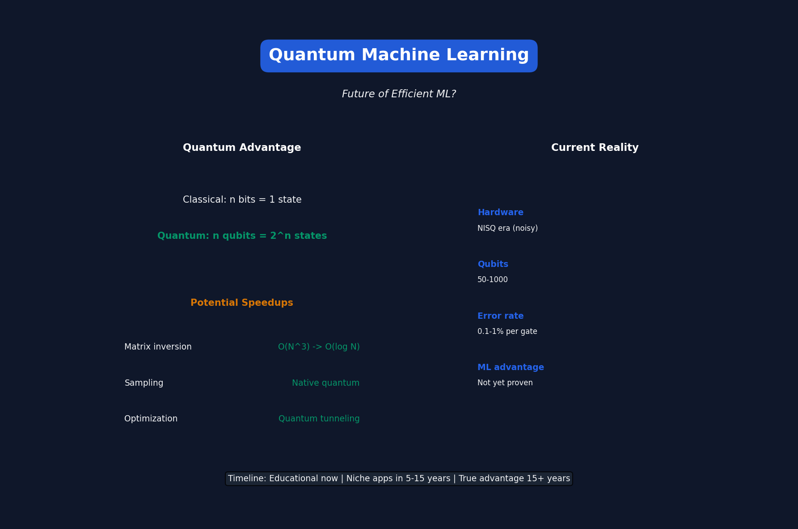

# Lecture 18: Quantum Machine Learning

[← Back to Course](../README.md) | [← Previous](../17_efficient_diffusion_models/README.md)

📺 [Watch Lecture 18 on YouTube](https://www.youtube.com/watch?v=x6jf57bV3Ic&list=PL80kAHvQbh-pT4lCkDT53zT8DKmhE0idB&index=18)

[](https://colab.research.google.com/github/gaurav-redhat/efficientml_course/blob/main/18_quantum_ml/demo.ipynb) ← **Try the code!**

---




## What is Quantum Computing?

Classical computers use **bits** (0 or 1).
Quantum computers use **qubits** (superposition of 0 AND 1).

```
Classical bit: 0 OR 1
Qubit: α|0⟩ + β|1⟩ (both simultaneously!)

n bits: 1 state
n qubits: 2^n states simultaneously
```

---


## Why Quantum for ML?

Potential advantages:

| Problem | Classical | Quantum |
|---------|-----------|---------|
| Matrix inversion | O(N³) | O(log N) |
| Sampling | Slow for complex distributions | Native |
| Optimization | Gets stuck | Quantum tunneling |

---


## Quantum Basics for ML

### Superposition
```
Qubit can be in multiple states at once:
|ψ⟩ = α|0⟩ + β|1⟩

|α|² + |β|² = 1 (probability normalization)
```

### Entanglement
```
Two qubits can be correlated:
|ψ⟩ = (|00⟩ + |11⟩) / √2

Measuring one instantly determines the other!
```

### Interference
```
Quantum states can add or cancel:
Path 1 + Path 2 = Amplified (constructive)
                  or Zero (destructive)
```

---


## Quantum Gates

Like classical logic gates, but reversible:

| Gate | Effect |
|------|--------|
| X (NOT) | Flip |0⟩ ↔ |1⟩ |
| H (Hadamard) | Create superposition |
| CNOT | Controlled NOT |
| RY(θ) | Rotation |

---


## Variational Quantum Circuits

The quantum analog of neural networks:

```
Classical NN:
Input → Linear → Activation → Linear → Output

Quantum "NN" (Variational Circuit):
|0⟩ → Encode input → Parameterized gates → Measure
                          ↓
                    Train parameters θ
```

---


## Quantum Neural Network

```python
import pennylane as qml

@qml.qnode(device)
def quantum_neural_net(inputs, weights):
    # Encode classical data
    for i, x in enumerate(inputs):
        qml.RY(x, wires=i)
    
    # Parameterized quantum layers
    for layer in range(n_layers):
        for i in range(n_qubits):
            qml.RY(weights[layer, i, 0], wires=i)
            qml.RZ(weights[layer, i, 1], wires=i)
        # Entangling gates
        for i in range(n_qubits - 1):
            qml.CNOT(wires=[i, i+1])
    
    # Measure
    return [qml.expval(qml.PauliZ(i)) for i in range(n_qubits)]
```

---


## Quantum Kernels

Use quantum computer to compute kernel:

```
k(x, y) = |⟨φ(x)|φ(y)⟩|²

where φ(x) is quantum feature map
```

Potentially exponentially hard to compute classically!

---


## Quantum Advantage Claims

| Claim | Status |
|-------|--------|
| Quantum supremacy (sampling) | Demonstrated (2019) |
| Useful ML speedup | Not yet proven |
| Fault-tolerant quantum ML | Decades away |

**Current reality:** NISQ (Noisy Intermediate-Scale Quantum) devices
- 50-1000 qubits
- High error rates
- Short coherence times

---


## Hybrid Classical-Quantum

Most practical approach today:

```
Classical preprocessing → Quantum circuit → Classical postprocessing
        ↓                      ↓                      ↓
   Feature extract         Compute             Aggregate
```

Example: Quantum feature extraction + Classical SVM

---


## Quantum for Optimization

**QAOA (Quantum Approximate Optimization Algorithm):**

```
Good for combinatorial optimization:
- Portfolio optimization
- Scheduling
- Graph problems

Still researching whether better than classical...
```

---


## Current Quantum Hardware

| Provider | Qubits | Technology |
|----------|--------|------------|
| IBM | 1000+ | Superconducting |
| Google | 70 | Superconducting |
| IonQ | 32 | Trapped ions |
| D-Wave | 5000+ | Annealing (special purpose) |

---


## Limitations

### 1. Noise
```
Error rate: ~0.1-1% per gate
Max circuit depth: ~100-1000 gates
```

### 2. Connectivity
```
Not all qubits connect directly
Need SWAP gates → More errors
```

### 3. Measurement
```
Measuring destroys quantum state
Need many shots for statistics
```

### 4. Data Loading
```
Encoding classical data into qubits is expensive
Often O(N) just to load data!
```

---


## Quantum ML Frameworks

| Framework | Provider |
|-----------|----------|
| Qiskit | IBM |
| Cirq | Google |
| PennyLane | Xanadu |
| Amazon Braket | AWS |

---


## Realistic Assessment

**Short term (now - 5 years):**
- Educational/research value
- Possible niche applications
- Hybrid classical-quantum

**Medium term (5-15 years):**
- Error correction improvements
- Quantum advantage for specific problems

**Long term (15+ years):**
- Fault-tolerant quantum computing
- Potential for true quantum ML speedups

---


## Key Papers

- 📄 [Quantum Machine Learning](https://arxiv.org/abs/1611.09347) - Survey
- 📄 [Variational Quantum Eigensolver](https://arxiv.org/abs/1304.3061)
- 📄 [QAOA](https://arxiv.org/abs/1411.4028)
- 📄 [Quantum Supremacy](https://www.nature.com/articles/s41586-019-1666-5)

---


## Summary

| Aspect | Status |
|--------|--------|
| Theory | Promising |
| Hardware | Improving rapidly |
| Practical ML advantage | Not yet demonstrated |
| Worth learning | Yes, for the future |

> "Quantum computing is like fusion power — always 20 years away. But we're getting closer."

---


## Resources

- [IBM Quantum](https://quantum-computing.ibm.com/)
- [Google Quantum AI](https://quantumai.google/)
- [PennyLane Tutorials](https://pennylane.ai/qml/)

