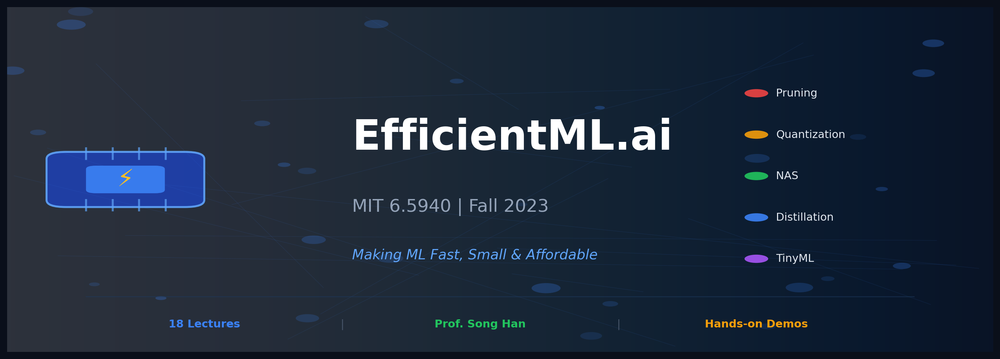

<p align="center">
  
</p>

<p align="center">
  <a href="https://www.youtube.com/playlist?list=PL80kAHvQbh-pT4lCkDT53zT8DKmhE0idB">
    
  </a>
  <a href="https://efficientml.ai/">
    
  </a>
  <a href="https://songhan.mit.edu/">
    
  </a>
</p>

---

## So, What's This About?

Ever tried running a 70B parameter model on your laptop? Yeah, that doesn't work. 

This course tackles the real problems ML engineers face every day:
- Your model is too big to fit in memory
- Inference is too slow for production
- Training costs more than your salary
- Edge devices have like... 256KB of RAM

**Song Han** (the guy behind Deep Compression, ProxylessNAS, and a bunch of other cool stuff) teaches you how to actually solve these problems.

---

## The Roadmap

```
┌─────────────────────────────────────────────────────────────────────┐
│                                                                     │
│   COMPRESSION                    ARCHITECTURE              SCALE    │
│   ───────────                    ────────────              ─────    │
│                                                                     │
│   ┌─────────┐    ┌─────────┐    ┌─────────┐    ┌─────────────────┐ │
│   │ Pruning │───►│ Quant.  │───►│   NAS   │───►│   Distributed   │ │
│   └─────────┘    └─────────┘    └─────────┘    │    Training     │ │
│       │              │              │          └─────────────────┘ │
│       ▼              ▼              ▼                    │         │
│   ┌─────────┐    ┌─────────┐    ┌─────────┐            ▼         │
│   │ Lottery │    │  GPTQ   │    │  OFA    │    ┌─────────────────┐ │
│   │ Ticket  │    │   AWQ   │    │ MnasNet │    │  DeepSpeed/FSDP │ │
│   └─────────┘    └─────────┘    └─────────┘    └─────────────────┘ │
│                                                                     │
│   DEPLOYMENT                                                        │
│   ──────────                                                        │
│                                                                     │
│   ┌─────────┐    ┌─────────┐    ┌─────────┐    ┌─────────────────┐ │
│   │ TinyML  │    │  Flash  │    │  vLLM   │    │    Diffusion    │ │
│   │ MCUNet  │    │ Attn.   │    │ Spec.Dec│    │   Distillation  │ │
│   └─────────┘    └─────────┘    └─────────┘    └─────────────────┘ │
│                                                                     │
└─────────────────────────────────────────────────────────────────────┘
```

---

## Course Contents

### Part 1: Make It Smaller

| # | Lecture | What You'll Learn | Colab |
|:-:|---------|-------------------|:-----:|
| 1 | **[Intro](./01_introduction/)** | Why efficiency matters | [](https://colab.research.google.com/github/gaurav-redhat/efficientml_course/blob/main/01_introduction/demo.ipynb) |
| 2 | **[Basics](./02_basics/)** | FLOPs, roofline model | [](https://colab.research.google.com/github/gaurav-redhat/efficientml_course/blob/main/02_basics/demo.ipynb) |
| 3 | **[Pruning I](./03_pruning_sparsity_1/)** | Magnitude pruning | [](https://colab.research.google.com/github/gaurav-redhat/efficientml_course/blob/main/03_pruning_sparsity_1/demo.ipynb) |
| 4 | **[Pruning II](./04_pruning_sparsity_2/)** | Lottery ticket | [](https://colab.research.google.com/github/gaurav-redhat/efficientml_course/blob/main/04_pruning_sparsity_2/demo.ipynb) |
| 5 | **[Quantization I](./05_quantization_1/)** | INT8, PTQ | [](https://colab.research.google.com/github/gaurav-redhat/efficientml_course/blob/main/05_quantization_1/demo.ipynb) |
| 6 | **[Quantization II](./06_quantization_2/)** | QAT, GPTQ, AWQ | [](https://colab.research.google.com/github/gaurav-redhat/efficientml_course/blob/main/06_quantization_2/demo.ipynb) |

### Part 2: Design It Better

| # | Lecture | What You'll Learn | Colab |
|:-:|---------|-------------------|:-----:|
| 7 | **[NAS I](./07_neural_architecture_search_1/)** | DARTS, search spaces | [](https://colab.research.google.com/github/gaurav-redhat/efficientml_course/blob/main/07_neural_architecture_search_1/demo.ipynb) |
| 8 | **[NAS II](./08_neural_architecture_search_2/)** | Hardware-aware NAS | [](https://colab.research.google.com/github/gaurav-redhat/efficientml_course/blob/main/08_neural_architecture_search_2/demo.ipynb) |
| 9 | **[Distillation](./09_knowledge_distillation/)** | Teacher-student | [](https://colab.research.google.com/github/gaurav-redhat/efficientml_course/blob/main/09_knowledge_distillation/demo.ipynb) |
| 10 | **[TinyML](./10_mcunet_tinyml/)** | MCUNet, 256KB | [](https://colab.research.google.com/github/gaurav-redhat/efficientml_course/blob/main/10_mcunet_tinyml/demo.ipynb) |

### Part 3: Run It Faster

| # | Lecture | What You'll Learn | Colab |
|:-:|---------|-------------------|:-----:|
| 11 | **[Efficient Transformers](./11_efficient_transformers/)** | FlashAttention, linear attn | [](https://colab.research.google.com/github/gaurav-redhat/efficientml_course/blob/main/11_efficient_transformers/demo.ipynb) |
| 12 | **[Efficient Training](./12_efficient_training/)** | Gradient checkpointing | [](https://colab.research.google.com/github/gaurav-redhat/efficientml_course/blob/main/12_efficient_training/demo.ipynb) |
| 13 | **[On-Device Training](./13_on_device_training/)** | TinyTL, bias-only | [](https://colab.research.google.com/github/gaurav-redhat/efficientml_course/blob/main/13_on_device_training/demo.ipynb) |
| 14 | **[Distributed](./14_distributed_training/)** | ZeRO, FSDP | [](https://colab.research.google.com/github/gaurav-redhat/efficientml_course/blob/main/14_distributed_training/demo.ipynb) |

### Part 4: Real-World Systems

| # | Lecture | What You'll Learn | Colab |
|:-:|---------|-------------------|:-----:|
| 15 | **[Vision Models](./15_efficient_vision_models/)** | MobileNet, DW-Sep Conv | [](https://colab.research.google.com/github/gaurav-redhat/efficientml_course/blob/main/15_efficient_vision_models/demo.ipynb) |
| 16 | **[LLMs](./16_efficient_llms/)** | KV cache, speculative dec | [](https://colab.research.google.com/github/gaurav-redhat/efficientml_course/blob/main/16_efficient_llms/demo.ipynb) |
| 17 | **[Diffusion](./17_efficient_diffusion_models/)** | LCM, fast sampling | [](https://colab.research.google.com/github/gaurav-redhat/efficientml_course/blob/main/17_efficient_diffusion_models/demo.ipynb) |
| 18 | **[Quantum ML](./18_quantum_ml/)** | Quantum basics | [](https://colab.research.google.com/github/gaurav-redhat/efficientml_course/blob/main/18_quantum_ml/demo.ipynb) |

---

## The Numbers That Matter

```
╔══════════════════════════════════════════════════════════════════╗
║                                                                  ║
║   Pruning      →  90% weights removed, same accuracy             ║
║   Quantization →  4x memory reduction (FP32 → INT8)              ║
║   FlashAttention → 2-4x faster, O(N) memory                      ║
║   Speculative  →  2-3x faster generation                         ║
║   LoRA         →  Train 0.1% of parameters                       ║
║   MCUNet       →  ImageNet on 256KB RAM (first ever!)            ║
║                                                                  ║
╚══════════════════════════════════════════════════════════════════╝
```

---

## Papers You'll Actually Understand After This

Reading papers is hard. After each lecture, these will make sense:

| If you want to... | Read this |
|-------------------|-----------|
| Prune models | [Learning Weights and Connections](https://arxiv.org/abs/1506.02626) (Han et al.) |
| Find winning tickets | [Lottery Ticket Hypothesis](https://arxiv.org/abs/1803.03635) (Frankle & Carlin) |
| Quantize LLMs | [GPTQ](https://arxiv.org/abs/2210.17323), [AWQ](https://arxiv.org/abs/2306.00978) |
| Run on microcontrollers | [MCUNet](https://arxiv.org/abs/2007.10319) (Lin et al.) |
| Speed up attention | [FlashAttention](https://arxiv.org/abs/2205.14135) (Dao et al.) |
| Serve LLMs efficiently | [vLLM](https://arxiv.org/abs/2309.06180) (Kwon et al.) |
| Train huge models | [ZeRO](https://arxiv.org/abs/1910.02054) (Rajbhandari et al.) |

---

## Who Should Take This?

**Yes, if you:**
- Deploy ML models in production
- Work with limited compute/memory
- Want to understand how ChatGPT runs so fast
- Build mobile/edge ML applications
- Train large models without infinite GPUs

**Maybe not if you:**
- Just started learning ML (do Andrew Ng's course first)
- Only care about theory, not deployment
- Have unlimited compute budget (must be nice)

---

## Prerequisites

```python
required = [
    "Basic ML (what's a neural network, backprop)",
    "Python (you can write a training loop)",
    "PyTorch (or willing to learn)",
]

helpful_but_optional = [
    "GPU programming basics",
    "Understanding of CNNs/Transformers",
    "Linear algebra refresher",
]
```

---

## How to Use This Repo

1. **Watch** the lecture on YouTube
2. **Read** the summary here (yes, I watched all 18 lectures and took notes)
3. **Try** the code examples
4. **Read** the papers if you want to go deeper
5. **Build** something with what you learned

Each lecture folder has:
- `README.md` — Key concepts, code snippets, takeaways
- Links to relevant papers
- Practical tips

---

## Quick Links

📺 [YouTube Playlist](https://www.youtube.com/playlist?list=PL80kAHvQbh-pT4lCkDT53zT8DKmhE0idB) • 
🌐 [Course Website](https://efficientml.ai/) • 
👨‍🏫 [Song Han's Lab](https://songhan.mit.edu/) • 
📚 [HAN Lab GitHub](https://github.com/mit-han-lab)

---

## Acknowledgments

All credit goes to **Prof. Song Han** and the MIT HAN Lab team for creating this amazing course and making it freely available. This repo is just my study notes — go watch the actual lectures, they're excellent.

---

<p align="center">
  <i>If this helped you, star the repo ⭐</i>
</p>
